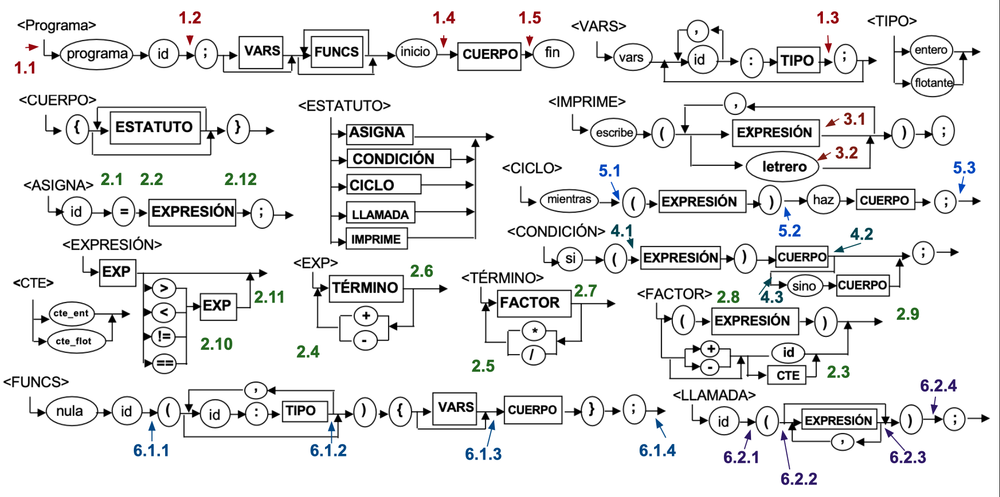

# Patito - Compiler
This project is an implementation of a compiler for a simple C-based programming laguage for the class *Advanced Applications Development in Computer Science (Group 502)*. The implementation is done in JavaScript using ANTLR. You can find the basic grammar [here](./Gramatica.pdf). 

## Student Information

* Name: Luis Ángel Guzmán Iribe
* ID: a01747157
* Email: a01747157@tec.mx

## Repository Structure

* Top Level: The top level of this repository contains files related to ANTLR which serve as the basis for the compiler.
* `/classes`
    Implementations of the data structures specified in assignment 1
* `/tests`
    * Test cases for each of the implemented data structures
    * Test cases for different test programs
* `index.js`
    Root file of the repository, currently not in use.
* `/compiler`
    Implementations of the data structures used in the generation of intermediate code for the compiler.

## Neural Points


## Version #1

### ANTLR
ANTLR was chosen over other alternatives for generating the parser and lexer for its ease of use, popularity, availaibity of documentaation and simple syntax. The rules are difned on the `PatitoLexer.g4` (which defines the valid tokens) and `PatitoParser.g4` (which defines the grammar).

The tokens are defined in ANTLR (`.g4`) format, such as:
```
VARS: 'vars';
CTE_ENT: [0-9]+;
SEMICOLON: ';';
```

The grammar is simmilarly defined in ANTLR (`.g4`) format, the appear like this:
```
programa: PROGRAM ID SEMICOLON tiene_vars lista_funcs INICIO cuerpo FIN;
ciclo: MIENTRAS LPAR expresion RPAR HAZ cuerpo SEMICOLON;
imprime: ESCRIBE LPAR lista_impresiones RPAR SEMICOLON;
```

### Generating parser and lexer
1. Add the following to your `.bash_profile` or `.zshrc` file to make ANTLR available globally.
```bash
export CLASSPATH=".:/usr/local/lib/antlr-4.13.0-complete.jar:$CLASSPATH"
alias antlr4='java -Xmx500M -cp "/usr/local/lib/antlr-4.13.0-complete.jar:$CLASSPATH" org.antlr.v4.Tool'
alias grun='java -Xmx500M -cp "/usr/local/lib/antlr-4.13.0-complete.jar:$CLASSPATH" org.antlr.v4.gui.TestRig'
```
2. Execute `antlr4 -Dlanguage=JavaScript PatitoLexer.g4` to generate the ANTLR lexer files.
3. Execute `antlr4 -Dlanguage=JavaScript PatitoParser.g4` to generate the ANTLR parser files.

## Version #2

### Sematic Cube
The semantic cube in this compiler is represented by a JavaScript which you can find on `compiler/SemanticCube.js`. This allows for easy *O(1)* complexity access to the information. The cube concists of a series of nested objects which act as dictionaries that look like this: 

```js
sematicCube = {
    '+': { // addition
        'ent': {
            'ent': 'ent',
            'flot': 'flot',
        },
        'flot': {
            'ent': 'flot',
            'flot': 'flot',
        },
    }
    // ...
}
```

In the future this will allow for acces to the information to look like this: `type = sematicCube['+']['ent']['flot']`, in the same order a quadruples.

### Functions Directory

The function directory is a managed by a class which contains a JavaScript object, which allows for easy access to functions present on a program, you can find it on `compiler/FunctionDir.js`. This class also provides utility functions to add functions to the directory, consult the list of cuntions and check if a function already exists. 

The class has the following structure.

```js
class FunctionDir {
    constructor() {
        this.functions = {};
    }
    getFunctions() { }

    addFunction(name, type) { }

    hasFunction(name) { }
}
```

The `functions` attribute looks like this.
```js
{
  test1: {
    name: 'test1',
    type: 'programa',
    variables: VarTable { variables: [Object] }
  },
  suma: {
    name: 'suma',
    type: 'nula',
    variables: VarTable { variables: [Object] }
  }
}
```
 
### Variable Table
Each function in the directory has a `variable` attribute which contains the variable table for the function, it is implemented as a JavaScript class which contains a dictionary which stores the variables for the function; you can find it on `compiler/FunctionDir.js`.

The class has the following structure.

```js
class VarTable {
    constructor() {
        this.variables = {};
    }

    getVars() { }

    addVar(name, type) { }

    hasVariable(name) { }
}
```

The `variables` attribute looks like this.
```js
{
    "x":{"name":"x","type":"entero"},
    "y":{"name":"y","type":"entero"},
    "z":{"name":"z","type":"entero"}
}
```

### Neural Points
In order to populate this tables, a series of neural points were implemented on the grammar to aid the semantic analysis based on the lexical analysis. This was done embeding JavaScript code on the `PatitoParser.g4` file. 4 points were implemented to manage the functions and the variables on the file.

#### 1. Function Directory and Variable Tables management

1.1 This action is executed when the `programa` rule is matched. It sets the `currType` to `programa`, assigns `currFunc` to the program’s name (ID), and adds the main function to the Function Directory with its type and identifier.

1.2 This action is performed when a `variable` declaration (with type and identifiers) is encountered. It sets `currType` to the declared type and splits the identifier list (`lista_ids`) into individual variables. Each variable is then added to the current function’s variable table with the specified type.

1.3 When a new function declaration is detected, this action sets `currType` to `nula`, indicating a void function. It assigns `currFunc` to the function identifier. If the function already exists in the Function Directory, it logs an error. Otherwise, it adds the new function to the Function Directory with its identifier and type.

1.4 Executed when parsing a function parameter, this action sets `currType` to the parameter’s type and `currVar` to its identifier. It checks if the parameter is already defined in the current function’s variable list. If not, it adds the parameter to the current function’s variables in Function Directory with its type.

## Version #3

### Data structures

#### Stacks

3 new classes were created to handle aritmetic and logic expressions, as well as conditional stantements and cycles present on the neural points. These classes were implemented using a base `Stack` class created on the initial commit of this repo, and all 3 are extensions of said class. 
* OperandStack
* OperatorStack
* JumpStack

#### Queues

A new class was created to handle the quadruple list for all of the following neural points. This class was implemented as an extension of the original `Queue` class created on the initial commit of this repo.
* QuadrupleQueue

### Neural Points

#### 2. Aritmetic and logic expressions 

**2.1** Pushes the variable onto the operand stack for assignment operations.

**2.2** Pushes the assignment operator (=) onto the operator stack.

**2.3** Processes operand and determines it's type (variable, integer, or float), and pushes it to the operand stack.

**2.4** Pushes either the + or - operator onto the operator stack.

**2.5** Pushes either the * or / operator onto the operator stack.

**2.6** Checks for addition or subtraction, pops operands and operator and generates a quadruple with the appropiate resulting type.

**2.7** Checks for multiplication or division, pops operands and operator and generates a quadruple with the appropiate resulting type.

**2.8** Pushes a left parenthesis ( onto the operator stack to handle nested expressions.

**2.9** Checks for and pops a left parenthesis ( from the operator stack, ending nested expression.

**2.10** Pushes a comparison operator onto the operator stack.

**2.11** Checks for comparison operators (<, >, ==, !=), pops operands and operator from stacks, creates a result variable, and adds a comparison quadruple.

**2.12** Handles assignment, pops remaining operator, and adds a quadruple for the assignment.

#### 3. Printing

**3.1** Adds a print quadruple with the value from the operand stack.

**3.2** Adds a print quadruple for a string literal.

#### 4. Conditional statement

**4.1** Generates a gotoF (conditional jump) quadruple based on the result of an expression present on the operand stack, leaves jump position undefined.

**4.2** Completes the if statement by filling in the jump position for an unconditional jump.

**4.3** Generates an unconditional goto quadruple and sets up the jump location for else blocks.

#### 5. Cycles

**5.1** Pushes the current quadruple location for the start of a while loop onto the jump stack.

**5.2** Generates a gotoF (conditional jump) quadruple based on the result of an expression present on the operand stack, leaves jump position undefined.

**5.3** Generates a goto quadruple to loop back to the start and fills in the exit jump location for the loop.

## Version #4

### Virtual Memory Direction

An object containing the memory direction ranges for different kinds of variables was declared on the `FunctionDir.js`file. This replaces the previous ussage of variables as objects containing a `name` and `type` attributes.

| Type      | RANGE          | INT            | FLOAT          | STRING         |
|-----------|----------------|----------------|----------------|----------------|
| Global    | [1000, 9999]   | [1000, 4999]   | [5000, 9999]   | -              |
| Temporal  | [10000, 19999] | [10000, 14999] | [15000, 19999] | -              |
| Local     | [20000, 29999] | [20000, 24999] | [25000, 29999] | -              |
| Constante | [30000, 44999] | [30000, 34999] | [35000, 39999] | [40000, 44999] |

The code was updated to handle variable creation through this process, the class `VarTable` was deprecated and was absorved by `FunctionDir`; now adding variables increases a counter to manage the memory direction assigned to each variable, as well as determining the ammoun of resources needed by the program.

### Operator codes

Operator codes were implemented for quadruples, assigning each operator a numerical value which can be easily read. THe codes are the following:

| Operator   | Description      | Code |
|------------|------------------|------|
| +          | Addition         | 1    |
| -          | Subtraction      | 2    |
| *          | Multiplication   | 3    |
| /          | Division         | 4    |
| >          | More than        | 5    |
| <          | Less than        | 6    |
| ==         | Equals           | 7    |
| !=         | Doesn't equal    | 8    |
| =          | Assignation      | 9    |
| print      | Print            | 10   |
| goto       | Goto             | 11   |
| goto True  | Goto if True     | 12   |
| goto False | Goto if False    | 13   |
| endfunc    | End Function     | 14   |
| era        | Activation Record| 15   |
| gosub      | Go to Subroutine | 16   |
| param      | Parameter        | 17   |

### Neural points

#### 6. Modules

##### 6.1 Module declaration

**6.1.1** Adds the module to the function directory.

**6.1.2** Adds the parameter to the variable table and parameter list of the function.

**6.1.3** Sets the start quadruple for the function on the function directory.

**6.1.4** Releases the variable table for the declared function, adds 'endfuncion' quadruple to signify the end of the function.

##### 6.2 Module calling

**6.2.1** Verifies the existence of the function in the function directory. Logs an error if the function is undefined.

**6.2.2** Adds an ERA quadruple to prepare the memory for the function call and initializes the parameter counter.

**6.2.3** Pops a parameter from the operand stack, checks its type, and adds a PARAM quadruple to associate it with a formal parameter. Throws error if number of parameters is exceded. Increments the parameter counter for the next parameter.

**6.2.4** Checks that the parameter counter points to a null element.

**6.2.5** Adds a GOSUB quadruple to jump to the functions start address and resume execution there.

## Version #5

This version implements a Virtual Machine capable of exequting the quadruples created on the previous versions. For this, the previous code was moved into a `compile` function, which stores the quadruples, functions, constants and memmory requirements inside of a file ending with **obj.txt**. Such file would look like this:
```
11,,,1
9,30000,,1000
9,30001,,1001
2,30003,1000,10000
1,30002,10000,10001
9,10001,,1002
2,30004,1000,10002
9,10002,,1001
10,,,40000
10,,,1002
10,,,40001
10,,,1001
10,,,40002
2,30006,1000,10003
1,30005,10003,10004
10,,,10004
$

$
30000,3
30001,2
30002,5
30003,0
30004,0
40000,C!
40001,B!
40002,Coso!
30005,5
30006,0
$
3,2,5,0,0,0,7,0,3
```

### Virtual Machine
The virtual machine executes instructions sequentially, simulating the logic, control flow, and operations of the original program. It executes the quadruples using an instruction pointer which navigates the quadruples list and can be programatically moved for conditional and cyclical statements.

#### Memory

Memory is simulated as an array of variable length based on the ammount of resources used during the compilation stage. Memory addresses are converted dynamically to point to the position they correspond on this array so that quadruples are still executable as they are.

##### Accessing memory
There are three functions used to set and access memory. The first of this we need to understand is `getReducedMemoryAddress`, which transforms the original memory address so that it access the reduced memory array, for instnce, the address **1000** will be converted to **0**, and following addresses are converted based on the ammount of variables required.

```js
getReducedMemoryAddress(address) {
    const category = Math.floor(address / 5000);
    address = category == 0 ? address - 1000 : address;
    const place = address % 5000;
    return this.memoryStartPoints[category] + place;
}
```

`getValue` uses this function to access the correct position on the memmory array.
```js
getValue(address) {
    return this.memory[this.getReducedMemoryAddress(address)];
}
```

`setValue` uses the same function to set the correct position on the memmory array with a certain value.
```js
setValue(address, value) {
    this.memory[this.getReducedMemoryAddress(address)] = value;
}
```

Given a starting point array like this:
```js
[0,  5,  5, 14, 14, 14, 14, 26, 26]
```

At the end of an execution, the memmory array should look like this:
```js
[8, 7, 21, 13, 21, 0, 0, 0, 0, 1, 7, 0, 21, 7, 8, 1, 1, 1, 0, 0, 0, 1, 2, 2, 1, 1, 'Error', 'Fibonacci', ':', 'Fibonacci', ':', 'Fibonacci', ':', 'Fibonacci', ':']
```

#### Memory Stack
The `localMemoryStack` array manages isolated memory for each function call by pushing a new memory block for variables. A new instantce to the array is added each time the **ERA** quadruple is encountered, and one instances is popped every time the `ENDFUNC` quadruple is encountered.`currentLocalMemory` tracks the active context, and memory is popped when a function ends.

#### Workflow

1. The VM loads the quadruples and metadata (e.g., function definitions, constants) from a compiled .obj file.
2. It interprets each quadruple:
    * Arithmetic/logical operations are executed and results are stored in memory.
    * Control flow instructions (e.g., jumps) manipulate the instruction pointer.
    * Function calls and parameter handling access specific local memory from the memory stack;.

## Testing
1. To run the tests that verify the functionality of the data structure implementations, parser and lexer, you need to install `node`.

2. Once installed, download the repository and run `npm install` to install the necessary dependencies.

3. Run `npm run test` to execute the tests.